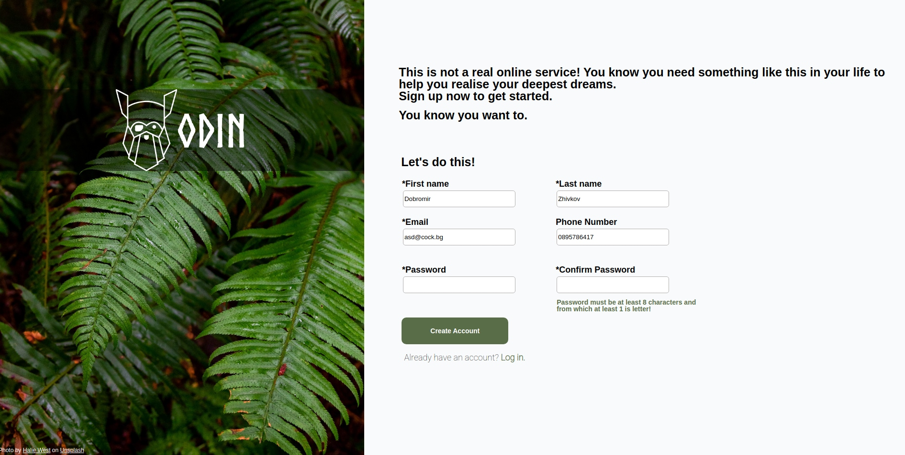
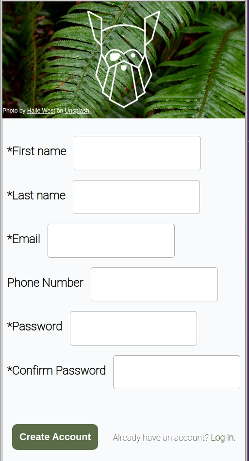

# Sign-up Form
## Desktop Version

## Mobile Version

## About the form
The form contains:
- A field for first name and last name
- A field for e-mail address
- A field for telephone number
- A password field. The password written in it must be at least 8 characters, from which at least 1 must be a letter.
- A confirm password field.
